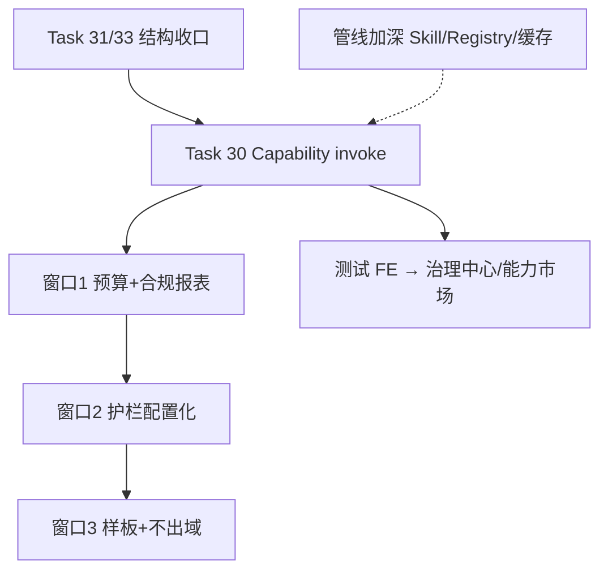

# Task 32: 治理做透改造总纲(V2.0 · 冻结待命)

> **状态: ⏸ 冻结待命(2026-08-04)。** 本文件只保留 **V2.0 新能力**(客户要付费的)。
> V1.x 结构债已拆走执行: Task 34(记忆统一,原 32.63)→ ✓ / Task 35(缓存统一,原 32.64)→ 执行中。
> **启动条件:** V1.x 全绿(34/35 完成 + journeys 实测 + EVID-03)+ 证据包(MANUAL_TEST)跑完。
> **范围红线:** 预算/报表/护栏配置化/命中率/不出域/样板间 = V2.0,冻结中不写代码;
> 已完成的 grill 设计(2026-08-03)全部保留在本文件,启动时直接可用,不重做。
> **总纲一句话:** 治理层做透 + 垂直场景做深，**不横铺执行层**（不抢 Dify/NocoBase）。
> **关联:**
> - 方向深挖原文 → `docs/V2_PROPOSAL.md`
> - 技术主线（Capability + 测试 FE）→ Task **30**
> - 结构债先收口（Agent 孤儿）→ Task **31**（Batch 1a）
> - Chat 旁路收口 → 建议 Task **33**（原 1b/1c，不在本文件展开）
> **原则:** 有审计/护栏/成本 → 变成客户能验收的交付物；新能力优先挂 `capability.invoke`，禁止再长第三条 chat 路径。

---

## 0. 我们怎么改造（总览）

三条并行轨道，职责不混：

```
轨道 S  结构收口     Task 31（Agent 孤儿）→ Task 33（Chat 旁路）
轨道 H  技术主线     Task 30（Capability Hub + 测试 FE）← 统一 invoke 闸门
轨道 G  治理交付     本 Task 32（预算/报表/护栏/不出域/样板 + 管线加深）
```



| 轨道 | 解决什么 | 不解决什么 |
|------|----------|------------|
| S | 双轨/三路径维护成本 | 不新增企业卖点 |
| H | 「一切皆能力」+ 治理一次做完 + 狗粮 FE | 不做自研 workflow studio |
| G | CIO 能管钱、能交合规、能自己调规则 | 不做充值计费/BI 大屏/多 region 产品 |

**成功标准（改造完成后对外可讲的三句话）:**
1. 所有模型/RAG/Agent/外部应用走同一 `invoke`，审计与成本不断链  
2. 租户有预算软硬限 + 一键合规报表（含导出留痕）  
3. 护栏可按租户配置且不能调松；有一个制度问答样板间能打 95 分演示  

---

## 1. 能力地图：现状 → 加强 → 落点

### A. 治理「能交付」（企业买单点）

| # | 能力 | 现状 | 加强方向 | 落点任务 | 窗口 |
|---|------|------|----------|----------|------|
| A1 | 合规报表 | CSV 导出 | Excel 模板 + 租户/风险/成本维度 + **导出留痕** | 32.10–32.12 | 1 |
| A2 | 护栏 | 规则硬编码 | DB 配置 + 租户覆盖，**只能同级或更严** | 32.20–32.22 | 2 |
| A3 | 预算 | 全局日限额 | 租户月度软/硬限 + 告警 + 看板进度（可接降级） | 32.01–32.04 | 1 |
| A4 | 不出域 | 有本地模型能力 | 强制路由策略 + 合规背书文档/配置 | 32.30–32.31 | 3 |
| A5 | 场景样板 | 模块齐、缺贯通 | 制度问答 95 分样板（SOP + 可选评测） | 32.40–32.41 | 3 |

> 细节方案与「不做」边界以 `docs/V2_PROPOSAL.md` §2.1–2.5 为准；本表只定改造顺序与任务号。

### B. Capability Hub（技术主线，不重复开坑）

**本 Task 不重写 Task 30。** 轨道 H 必须先于或并行于窗口 2 的护栏/预算「挂到 invoke」：

| 加强项 | 说明 | 归属 |
|--------|------|------|
| 统一 `capability.invoke` | 模型/RAG/Agent/Dify·Coze | Task 30.01–30.07 |
| 治理在 invoke 做一次 | 审计/护栏/限流/配额 | Task 30.05（+ 本 Task A 产出的预算/护栏 API） |
| Agent 调 Agent | 两条 capability 记录、深度上限/环检测 | Task 30.24 |
| 幂等 invoke + 成本记账 | 计划内 | Task 30.04 |
| 外部连接器凭证隔离 | 跨租户 | Task 30.07 |
| GraphSpec 类型地基 | studio 后置，类型先立 | Task 30 预留 / 窗口 2 末期可加 32.50 |
| 测试 FE 角色切换器 | 权限边界可视化 | Task 30.08–30.28 |
| 产品 FE：治理中心 / 能力市场 | 扩展阶段 | Task 30.29 + 本 Task D |

**硬约束:** A3 预算检查、A2 护栏求值，最终必须能被 `capability.invoke` 与现有 pipeline 节点共用同一实现（禁止两套规则引擎）。

### C. 管线与运行时（差异化加深）

| # | 点 | 加强 | 落点 | 窗口 |
|---|-----|------|------|------|
| C1 | Skill 短路径 | 命中率指标（LangFuse/metrics）+ 更多确定性 skill | 32.60 | 1 末或穿插 |
| C2 | ModelRegistry | 租户策略 + 预算感知路由（接 A3 硬限后 cheapest-in-tier） | 32.03 / 32.61 | 1–2 |
| C3 | Key failover | 租户可见健康看板（复用 admin/key 已有能力） | 32.62 | 2 |
| C4 | Context rot / memory | 明确归属：pipeline 节点 vs capability；禁止再散落新 service | 32.63（设计批） | 2 |
| C5 | RAG L1/L2 缓存 | 与 `ICacheService` / PerformanceOptimizer 统一语义 | 32.64 | 2–3 |

### D. 产品体验

| # | 短板 | 改造 | 落点 |
|---|------|------|------|
| D1 | 7 个散装 HTML QA | 测试 FE 替换（角色切换器） | Task 30 |
| D2 | 缺治理中心一屏 | 成本进度 / 护栏拦截 / 审计入口 / 配额 | Task 30.29 产品 FE；数据 API 来自 A1/A3 |
| D3 | 缺能力市场 | 统一目录（capability registry 列表） | Task 30.23 面板 → 30.29 产品化 |

### E. 刻意不做（写入验收负面清单）

- 自研 workflow studio（导航可预留，画布不做）
- Multi-region 产品化 → 降级运维文档（高可用/备份）
- 与 NocoBase/Dify 抢执行层 / 无代码业务
- 插件市场、SaaS 多租户化、模型微调、充值计费、BI 大屏
- 再开第四条「新 chat API」平行宇宙

---

## 2. 迭代窗口（执行顺序）

### 窗口 0 — 地基（可与窗口 1 并行启动）

| 序 | 任务 | 产出 |
|----|------|------|
| 0.1 | Task **31** | Agent 唯一真源 `backend.agent` |
| 0.2 | Task **30** 阶段 1a（30.01–30.07） | `capability.invoke` + 治理钩子空位 |
| 0.3 | Task **33**（建议） | Chat 旁路 deprecate / 并入 pipeline（可选，不堵窗口 1） |

### 窗口 1 — 治理第一刀(价值最快,约 2–3 周)

**给 CIO 的演示:** 预算看板 + 一键合规 Excel。

> **2026-08-03 grill 拍板(预算语义与引擎统一):**
> 1. 预算语义 = 单次防爆(已有 cost_manager.check_budget)+ 日配额(30.05 已实现)+ **月软/硬限(本窗口新增)**——三种窗口统一引擎,禁止多套规则引擎(Task 32 硬约束)。
> 2. 引擎落点 = **在 30.05 governance.py 现有 redis 桶上泛化**(已核实 30.05 已合并,governance.py:108 check_cap_quota 用 `rl:cap:calls:{tid}:{day}` 日桶)——加 `_bucket(window)` 支持 day/month,`check_cap_quota` 加 `window` 参数,月窗口复用同一套 check/record 函数。
> 3. **不建 tenant_budgets 表**(原 32.01):redis 月桶与日配额同构;软限=读月用量≥80%阈值告警(不拒),硬限=超上限拒绝(复用 CAP_005);看板数据 = redis 当前月桶 + audit_logs 历史聚合(redis 重启丢的实时计数可从审计恢复,不丢账)。
> 4. **降级由用户决定,不自动切(2026-08-03 二次拍板):** 80%-100% 软限只告警 + 提示可手动切 cheap,系统不替用户降档(有人最后 1 毛钱也要高质量输出)。
> 5. **硬限 = 拒绝 + 审批放行,账务两本账(2026-08-03 三次拍板):**
>    - 第一本账: 原预算(硬限不破);第二本账: 已批准放行额度(approval_overage)
>    - 每次放行审批 = 给**具体金额**(复用 approval_requests,用现有 `params` JSON 字段存 `{amount, reason}`,不新建审批表)
>    - 每笔调用记账: `cost` 照实记 + `budget_source`(within_budget / approved_overage)+ `approval_id`
>    - 看板三栏: 预算内支出 / 已批准超支 / 被拒金额——财务一眼看出超支是有领导批的
>    - **audit_logs 加 3 列**(006 migration): `budget_source VARCHAR(16)`, `approval_id INT NULL`, `overage_amount FLOAT NULL`

| 子任务 | 内容 | 依赖 |
|--------|------|------|
| **32.01** | governance.py 窗口泛化:`_bucket(window)` + `check_cap_quota(window=)` + `record_cap_quota_usage(window=)`;月桶 key `rl:cap:{calls,cost}:{tid}:{month}` | 30.05 已合并 |
| **32.02** | 软限告警(不自动降级):月用量 ≥ CAP_QUOTA_MONTHLY_SOFT_PCT(默认 80%)→ 审计 `budget_soft_warning` + 响应/看板提示"可手动切 cheap";不拒请求 | 32.01 |
| **32.03** | 硬限 = 拒绝 + 放行闭环:月硬限超 → CAP_005 + 响应带 `budget_overspend: true`;前端/调用方提示"可申请放行";新增 `POST /api/admin/budget-overage-requests`(resource_type='budget_overage', params={amount, reason})复用 approval_requests;审批通过 → 放行额度入 redis 月桶账本二(`rl:cap:overage:{tid}:{month}`),调用先扣放行额度再扣原预算 | 32.02, approval_requests 已有 |
| **32.04** | 成本看板进度(admin cost-summary 扩展):今日/本月已用(预算内 vs 已批准超支两栏)、单次上限、软限进度条、被拒金额;数据 = redis 月桶 + audit_logs(budget_source 聚合) | 32.01, 32.03 |
| **32.10** | 合规 Excel 导出(openpyxl):`redact` 参数(默认 true,复用 guardrails pii_patterns 脱敏 input/output)+ 多 sheet(明细/汇总-租户×模型×日成本矩阵/异常-error_code 非空)+ 预置筛选(租户/时间/动作/模型/成本区间);权限 gate 不破(`audit:export`) | 现有 `/api/audit/export` |
| **32.11** | 导出留痕(防"拿去做坏事"):每次导出写 audit_logs(action='audit.export', params={filters, row_count, redacted, file_hash})——谁、何时、什么条件、多少条、是否脱敏、文件哈希;导出权限校验不破 | 32.10 |
| **32.12** | 单测:脱敏开关生效、汇总 sheet 数字正确、留痕写入、权限 403 | 32.10–11 |
| **32.60** | 短路径命中率指标(指标→定位→修→验证闭环):3 个 Counter + 埋点 + PromQL + 测试 FE 面板 | pipeline model_router, metrics.py |

**窗口 1 验收一句话:** 租户超预算被拦(日/月硬限);超预算可申请放行且放行有金额、有审批号、账分两本;合规同学一键导出 Excel 且留下「谁导出了」记录;看板显示今日/本月(预算内+超支)进度。

### 32.60 短路径命中率指标(穿插项,完整方案)

> **2026-08-03 grill 拍板:** 选 B(运营指标)+ 成本节约估算字段。设计为「指标→定位→修→验证」开发闭环——指标不是展示,是驱动 skill 开发的输入。区分两个数: **skill 命中率**(skill_executed/总请求,真实省钱)与**短路径占比**(全部短终态/总请求,含缓存/拦截,运营参考)——直接用 is_short_path 会把 rate_limited/blocked 计入,数字虚高。

**方案(3 个 Counter + 埋点 + PromQL + FE 面板):**

1. **埋点**(`backend/core/metrics.py` 加 3 个 Counter,全部带 intent 标签):
   ```
   skill_hits_total{tenant, intent}     — finish_reason=skill_executed
   skill_misses_total{tenant, intent}   — intent 识别但 confidence < 0.85 → 落 LLM
   skill_errors_total{tenant, skill_id} — skill 执行失败(result.success=False)
   ```
   埋点位置: `backend/pipeline/nodes/model_router.py:27`(get_skill_for_intent 后,miss 分支)
   与 `:36`(finish_reason 判定处,hit/error 分支)。

2. **PromQL(3 条,直接回答问题):**
   ```promql
   总命中率:  sum(skill_hits_total) / (sum(skill_hits_total) + sum(skill_misses_total))
   按 intent: sum by (intent) (skill_hits_total) / sum by (intent) (skill_hits_total + skill_misses_total)
   按租户:    sum by (tenant) (skill_hits_total) / sum by (tenant) (skill_hits_total + skill_misses_total)
   ```

3. **测试 FE 面板**: 30.22 性能面板旁加「Skill 命中率」小面板(不用等 30.29):
   总命中率卡 + intent 命中率表格(降序,低的就是补 skill 机会)+ 租户维度切换。

4. **闭环用法(开发者视角):**
   ```
   跟踪: PromQL / FE 面板看总命中率
   定位: intent 命中率排序,低者 = 无 skill 覆盖(如 expense_approval 0% vs contract_query 100%)
   开发: backend/skills/builtin/ 加确定性 skill(30-100 行),registry.discover() 自动注册
   验证: 该 intent 的 hits 从 0 涨、misses 归零、cost_total 长路径下降 → 闭环完成
   ```

5. **成本节约估算**(B 附带,售前/demo 用): 短路径请求数 × 长路径均价(COST_TABLE 或 registry cost_per_1k)— 展示"本月因 skill/缓存省了 $X",CIO 一句话懂。

**依赖:** pipeline model_router(注意 Task 30 阶段 1a 正在改此文件——埋点设计现在定死,实现等 30 完成后,避免与 Cursor 冲突)。

### 窗口 2 — 差异化卖点（约 3–4 周）

> **2026-08-03 grill 拍板(护栏规则模型,方案 A):** 全局规则表 + 租户追加覆盖——**「只能更严」从模型上保证,不是靠代码检查**:
> - `guardrail_rules` 表(全局,super_admin 可改)+ `tenant_guardrail_overrides` 表(租户**只能追加**规则,不能删/改全局)
> - **代码默认值兜底**: DB 空/挂 → 回退现有模块级常量(INJECTION/PII/DRIFT/VIOLATION),护栏不因 DB 故障失效(P0 安全底线)
> - 全局升级(改代码新 regex)→ 自动对所有租户生效;租户追加规则不动,叠加生效
> - 租户追加三档: 新增正则(行业敏感词)/ 提高 PII 覆盖(打开某类)/ 调严参数(更短长度截断)
> - check_input/output 加 `tenant_id` 参数,读 DB 规则 + 代码默认值合并;默认行为与现网一致(回归硬要求)

| 子任务 | 内容 | 依赖 |
|--------|------|------|
| **32.20** | 护栏规则 DB 化:`guardrail_rules`(全局)+ `tenant_guardrail_overrides`(追加)两表 + migration;check_input/output 加 tenant_id 参数,DB 规则 + 代码默认值合并 | guardrails 包 |
| **32.21** | `/api/guardrails` 管理端点(super_admin 管全局,tenant_admin 管本租户追加)+ 变更写审计(action='guardrails.update', diff 记录) | 32.20 |
| **32.22** | 租户覆盖优先级(追加叠加,禁删全局)+ 回归「默认行为与现网一致」 | 32.20–21 |
| **32.61** | ModelRegistry 租户策略路由(与预算联动补强) | 32.03 |
| **32.62** | Key 健康看板（租户/admin 可见） | key_health 已有 |
| **32.63** | Memory/context 归属设计批(统一记忆存取层 + 8 项拍板,见下方完整设计) | — |
| **32.64** | 缓存语义统一(RAG 模式推广 + 删 ICacheService 僵尸,见下方完整设计) | Task 31 后更干净 |
| **32.50** | （可选）GraphSpec 类型地基 | Task 30 |

**窗口 2 验收一句话:** 客户能自己加严 PII/注入规则且改不动默认安全底线；invoke/pipeline 读同一规则源。

### 32.63 Memory/context 统一存取层设计(完整拍板,2026-08-03)

> **背景事实(已核实):** 仓库现有 4 套 memory 并存——① 关系型(chat_sessions/chat_messages/user_memories/cold_memories, pipeline 节点在用)② services 层(enhanced_memory_manager + ShortTermMemory, enhanced-chat 旁路)③ agent 层(MemoryHub + InMemoryStore, 真源但**纯内存重启丢**)④ models.py 的 memory_items/user_profiles(僵尸表)。
> **核心判断:** 不是"重复抄四遍"需要带头大哥,而是四个职责 + 中间断了存取层——补统一存取层,不合并职责。

**设计(8 项拍板,全部按推荐):**

1. **分层职责(不合并):**
   - chat_messages = 全量对话(事实/审计,不可删)
   - cold_memories = 摘要(长会话压缩,启用接线)
   - user_memories = 画像/偏好(kv,含向量)
   - MemoryHub = 统一存取层的 **agent 场景视图**(不是独立存储;scope 分级=查询视图,底层同一批表)→ agent 记忆自动持久化
2. **僵尸处置:** user_profiles 并入 user_memories(kv 画像已覆盖);memory_items 废弃(表保留,代码不引用)。
3. **向量维度统一(技术债):** user_memories/cold_memories 列从 Vector(1536) 迁移到 768(Task 28 的 text-embedding-v3 维度);旧向量重嵌或废弃,新数据正确(迁移方案: 空列新写,存量标记 deprecated)。
4. **摘要生成:** 触发式(会话 > N 轮才提炼)+ 规则生成起步(首尾+关键句,零 LLM 成本);LLM 提炼为配置项(质量敏感租户可开)。
5. **统一存取层 MemoryService.write()/read():** 所有写入口(write_memory 节点 / enhanced_memory_manager 提取器 / MemoryHub)收敛到唯一 write();读取可多视图(hot/warm/cold)。
6. **读取组装 + token 预算:** read() 输出三档(hot=最近 N 条 / warm=画像 / cold=摘要),按 token 预算组装(默认上下文窗口 30% 给记忆,超了先丢最旧摘要;预算比例可配)。
7. **记忆衰减:** 保留现有 decay(90%^天数,旧记忆权重降),迁进统一层,行为不变。
8. **删除/隐私:** 删一个 memory → 级联删同 user 的摘要+画像;提供"删除用户全部记忆"入口(被遗忘权);chat_messages 不可删(审计),以脱敏代替。
9. **Agent 调 Agent 记忆归属:** 记忆归**调用发起者**(外层 agent 的 user),子 agent 不写独立记忆——避免记忆碎片化。
10. **迁移:** 不动存量(chat_messages/user_memories 保留);cold_memories 空表启用;新代码只走统一层,零数据迁移。

**⚠️ system-role 不漂移(硬约束, Joe 拍板):**
> 记忆/画像/上下文拼进 prompt 时,**必须保持 system role,不能漂移**。
> 现状隐患: prompt_composer.py 的 `_build_role_prompt`(role/role_name/personality 可配)
> 与 `_build_memory_prompt`(记忆)平级拼接——若租户画像/记忆带消费域语气(如"喜欢活泼风"),
> 可能把助手带成人设漂移(呼应既有 DRIFT_PATTERNS 角色漂移检测)。
> **实现约束:**
> - 拼接顺序固定: system_prompt(SYSTEM_PROMPT.py 固定人格)→ role(租户配置,只能收敛不能放宽人格)→ memory(记忆,标记为"仅供参考的用户信息")→ context(会话历史)
> - memory 段前加隔离标记(如 `# 用户背景(仅供参考,不改变你的角色)`),防止记忆内容覆盖人格指令
> - 记忆拼入后跑 `check_role_drift`(复用 output_guard,DRIFT_PATTERNS)——漂移即拦截
> - 租户 role 配置只允许"收敛"(更专业/更正式),不允许"放宽"(更活泼/更随意)——与护栏"只能更严"同构

**依赖:** Task 31(清 modules 孤儿后 agent 路径干净);Task 30(capability 统一 invoke 后记忆写入口收敛)。

### 32.64 缓存语义统一(完整拍板,2026-08-03)

> **背景事实(已核实):** 仓库现有 3 套缓存——① ICacheService(interfaces.py:228 接口 + factories 工厂,但实现文件 cache_service.py **不存在**、零调用,僵尸)② PerformanceOptimizer + CacheManager(performance_optimizer.py:22, redis.asyncio 惰性连接,optimized_chat_service/streaming_chat 在用)③ RAG 两级缓存(rag/cache.py, Task 29: L1 答案 + L2 embedding + 单飞锁 + epoch 批量失效 + 静默降级 + metrics,质量最高)。
> **技术选型结论(调研 cachetools/cachelib 后):** 不引入。cachetools/cachelib 解决"进程内内存缓存淘汰策略"(LRU/LFU/TTL),不是分布式 redis 缓存——我们的 key 全有明确 TTL,淘汰交给 redis maxmemory,进程内 LRU 无需求;且跨 worker 一致性/单飞/epoch 它们都不提供。**复用自研 RAG 模板(已实测过 116 测试守护)比引入第三方更安全。**

**设计(方案 A,选型 + 统一):**

1. **统一公共 redis 工具** `backend/core/redis_tools.py`(新建):
   - 惰性连接(同步 + async 两套,从 RAG cache 和 PerformanceOptimizer 各抽一份合并)
   - 静默降级契约: redis 不可用 → 返回 None / 跳过,绝不因缓存 500(全站一致承诺)
2. **key 命名规范**: `rag:*` 模式推广——`ctx:*`(能力缓存)/`chat:*`(对话缓存)/`rl:cap:*`(30.05 已开)/`mem:*`(32.63 热记忆);统一前缀段 `<域>:<名>:<租户>:<键>`
3. **RAG 模式为模板推广**: 单飞锁(SET NX EX)、epoch 批量失效(INCR,写操作时失效)、滑动 TTL——PerformanceOptimizer/CacheManager 的裸 get/set 升级为模板行为
4. **删除僵尸**: ICacheService 接口 + CacheServiceFactory 删除(interfaces.py:228, factories.py:113;实现不存在、零调用,删比修便宜)
5. **保留**: PerformanceOptimizer 的 performance_monitor 装饰器(性能监控兼职,不属于缓存统一范围,别顺手拆)
6. **测试守护(安全保证写死)**: 单测覆盖——redis 挂 → 降级不 500、单飞锁并发仅一次回源、epoch 失效后旧 key 不可用、TTL 滑动续期

**依赖:** Task 31 后 modules 孤儿清除,agent 路径干净;与 32.63 呼应(记忆热缓存用同一 redis_tools)。

### 窗口 3 — 样板与背书（依赖 Windows/本地模型，约 2–3 周）

| 子任务 | 内容 | 依赖 |
|--------|------|------|
| **32.30** | 不出域：部署/合规章节 + 本地优先路由策略 | ModelRegistry, 本地端点 |
| **32.31** | 敏感标签 → 强制本地（出境检测后置） | 32.30 |
| **32.40** | 制度问答样板：seed + SOP + 全链路 curl（配置化，不硬编码行业） | RAG + 审批 + 审计 |
| **32.41** | （可选）场景评测集 + 可复现脚本 | 32.40 |
| **30.29** | 产品 FE：治理中心 + 能力市场 | 测试 FE 狗粮后 |

**窗口 3 验收一句话:** 售前能用「样板间 + 不出域材料」讲完私有化故事。

---

## 3. 与 Task 30 / 31 的接口契约

```
Task 31 完成后:
  Agent 实现唯一 → 30.24 门面零歧义

Task 30.05 治理强制:
  调用 backend 统一模块:
    - budget.check (来自 32.02)
    - guardrails.check_input/output (来自 32.20 配置驱动版)
  禁止在 invoke 内复制一份硬编码规则

Task 30 测试 FE:
  窗口 1 起可对接 cost-summary / audit export
  窗口 2 起可对接 guardrails API
  产品 FE(30.29) 等窗口 1–2 API 稳定后再做「治理中心」一屏
```

---

## 4. 子任务索引（待拆文件）

> 执行时按需拆成 `tasks/32/32.xx-*.md`（风格对齐 Task 30）；未拆前以本表 + V2_PROPOSAL 为 AC 来源。

| ID | 标题 | 窗口 | 依赖 |
|----|------|------|------|
| 32.01 | 限额引擎窗口泛化(governance.py redis 桶支持 day/month) | 1 | 30.05 |
| 32.02 | 月软限告警 + 硬限(复用 CAP_005) | 1 | 32.01 |
| 32.03 | 硬限拒绝 + 超预算放行审批闭环(两本账) | 1 | 32.02 |
| 32.04 | 成本看板预算进度(预算内/超支两栏 + 单次上限) | 1 | 32.01 |
| 32.10 | 合规 Excel 导出(脱敏开关 + 多 sheet + 筛选) | 1 | — |
| 32.11 | 导出留痕(谁/何时/条件/条数/脱敏/哈希) | 1 | 32.10 |
| 32.12 | 导出权限与测试 | 1 | 32.10–11 |
| 32.20 | 护栏规则 DB 化 | 2 | — |
| 32.21 | 护栏管理 API + 变更审计 | 2 | 32.20 |
| 32.22 | 租户覆盖 + 默认安全回归 | 2 | 32.20–21 |
| 32.30 | 不出域文档 + 本地优先路由 | 3 | 本地模型可用 |
| 32.31 | 敏感强制本地 | 3 | 32.30 |
| 32.40 | 制度问答样板 + SOP | 3 | — |
| 32.41 | 场景评测（可选） | 3 | 32.40 |
| 32.50 | GraphSpec 类型地基（可选） | 2 末 | Task 30 |
| 32.60 | 短路径命中率指标 | 1 穿插 | pipeline |
| 32.61 | 租户策略路由补强 | 2 | 32.03 |
| 32.62 | Key 健康看板 | 2 | — |
| 32.63 | Memory/context 归属 ADR | 2 | — |
| 32.64 | 缓存语义统一 | 2–3 | ICacheService |

---

## 5. 拍板表（勾选后开窗口 1）

沿用并收口 `docs/V2_PROPOSAL.md` §5：

| 方向 | 推荐默认 | 你的选择 |
|------|----------|----------|
| A3 预算 | 窗口 1：表+软硬限+看板，告警/降级同窗后半 | ☐ 同意 / ☐ 改 |
| A1 报表 | 窗口 1：Excel MVP + 导出留痕；定时打包后置 | ☐ 同意 / ☐ 改 |
| A2 护栏 | 窗口 2：API 先行，UI 随后（测试 FE / 产品 FE） | ☐ 同意 / ☐ 改 |
| A4 不出域 | 窗口 3：文档+强制路由；出境检测后置 | ☐ 同意 / ☐ 改 |
| A5 样板 | 窗口 3：样板+SOP；评测可选 | ☐ 同意 / ☐ 改 |
| 轨道 H | Task 30 与窗口 1 并行，窗口 2 前 invoke 可挂预算/护栏 | ☐ 同意 / ☐ 改 |
| 轨道 S | Task 31 先于或并行窗口 1；Chat 旁路 → Task 33 | ☐ 同意 / ☐ 改 |
| E 不做清单 | 全文 §1.E 生效 | ☐ 同意 |

---

## 6. 改造完成定义（Definition of Done）

- [ ] 窗口 1–3 对应子任务按序完成或显式砍掉并更新 ROADMAP
- [ ] 无新增平行 chat/agent 实现路径
- [ ] 预算硬限与护栏配置被 pipeline **和** capability.invoke 共用
- [ ] 合规导出有留痕；活跃文档指向 `/chat` + `/agent` + `/api/capabilities`（Task 30 后）
- [ ] `docs/ROADMAP.md` v2.0 段与本文件窗口对齐
- [ ] 本文件完成后移入 `tasks/archive/`，子任务文件随迁

---

## 7. 一页版话术（对内/售前）

**对内:** 先收口（31）→ 再统一闸门（30）→ 再把治理从「有 API」推到「能交付」（32）。  
**对外:** 编排工具随便换；钱能管、规能交、规则客户能加严、敏感可不出域——这些永远在网关。
